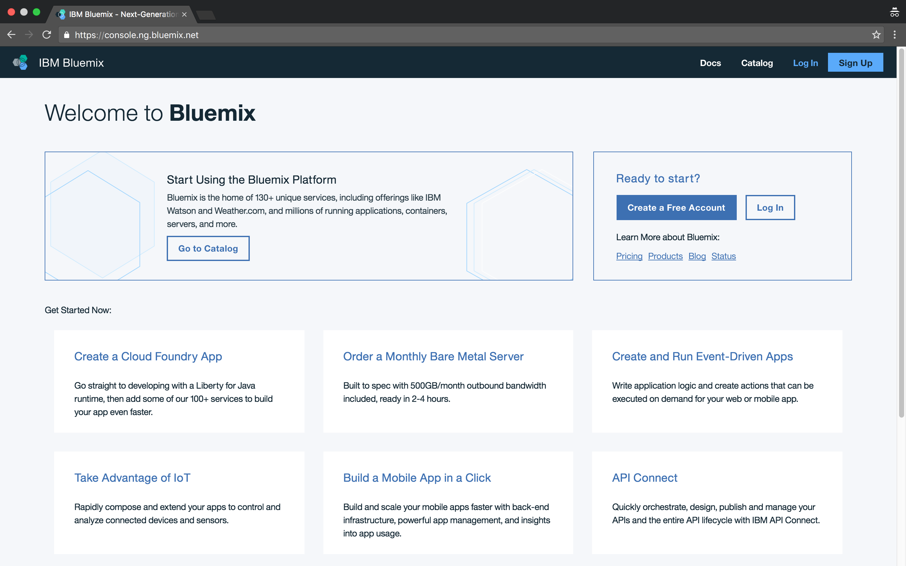
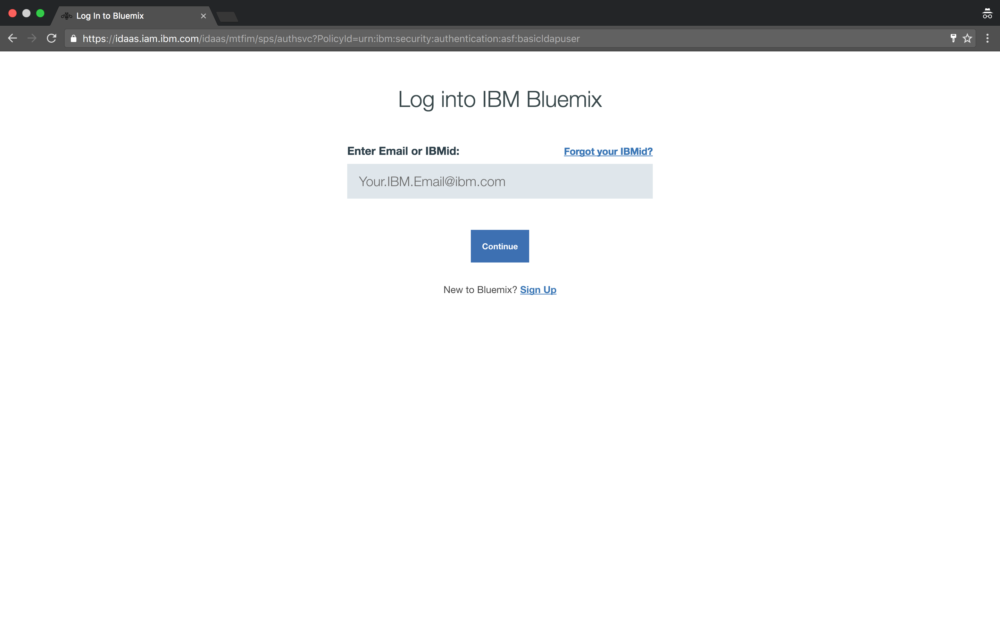
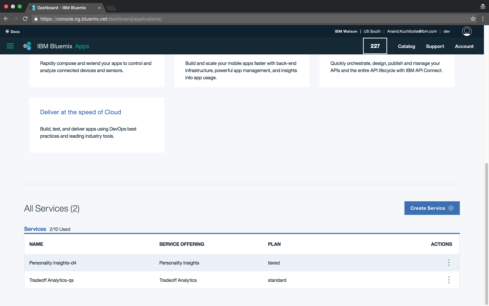
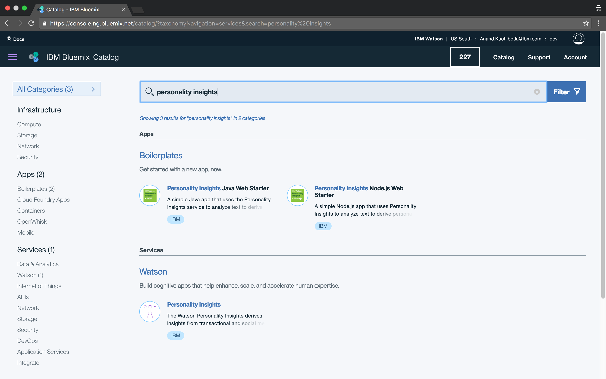
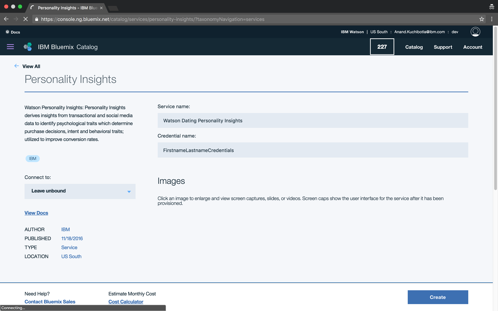
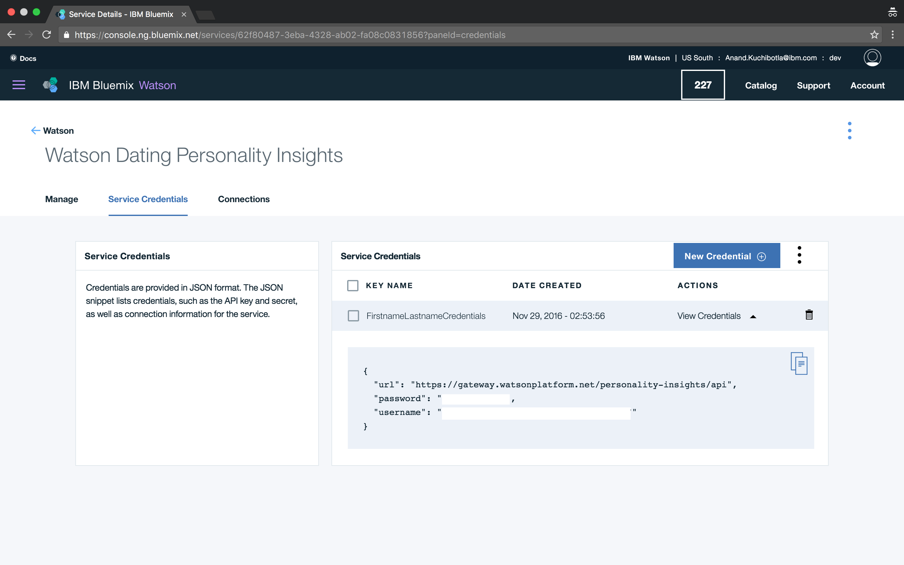

# Day Three


## APIs
APIs are the reason why people don't need to reinvent the wheel everytime they decide to make an app. APIs *expose* functions for us to be able to use the services of another company.

### Examples of APIs
[Twitter API](https://dev.twitter.com/rest/tools/console)

[Google Maps API](https://developers.google.com/maps/documentation/javascript/examples/map-simple)

[IBM Watson Personality Insights](https://personality-insights-livedemo.mybluemix.net/)

Make sure you check out that last one because it's what we're going to be using for the next few days.

## Getting Started with the IBM Watson API
### Credentials
In order to use any API service, you first have to acquire credentials that identify who you are and what your purpose is.

1) Go to Bluemix at https://bluemix.net



2) Log-in with your IBM credentials



3) Scroll down to the bottom of the page where you see services and select "Create Service"



4) Search for "personality insights" and select the Watson service that appears below



5) Name your service and credentials and press "Create"



6) In the Personality Insights page, select the "Service Credentials" tab



You've just created a set of credentials for yourself in order to use IBM Watson's API! These credentials are meant to be private. You should never share these credentials with anyone.

## SDKs
SDKs give you all the tools you need in order to easily run APIs. If APIs are pieces of wood, SDKs are hammers, nails, rulers, and saws.

### Installing Watson SDK for Python
Go into terminal and type `sudo pip install watson-developer-cloud`. This will prompt you for a password, type in the password to your Mac computer.

If this shows an error, it means that `pip` hasn't been installed yet. Run `sudo easy_install pip` and then after that completes, run the command above again and it should work.

Now we have installed the SDK for Python. To test this out, open an interactive Python shell in Terminal and run the following and make sure your output is similar to what the output is here:
```
>>> import watson-developer-cloud
>>> watson-developer-cloud
<module 'watson_developer_cloud' from '/Library/Python/2.7/site-packages/watson_developer_cloud/__init__.pyc'>
```
If you see something resembling the last line there, then you're good to go!

# Let's Get Down to Business


1) Find a large body of work you'd like to run personality insights on. There are some cool examples on [this website](http://www.americanrhetoric.com/top100speechesall.html). The longer the speech, the better!

2) Open a new Sublime file, copy and paste the speech inside it, and save it as `speech.txt` within Desktop/bootcamp.

3) Open a new Sublime file, go to the bottom right where it says "Plain Text" and select "Python". This is us telling Sublime that we will now be working on a Python file.

4) Copy the following into your Python file:
```
speech = open('speech.txt').read()
print speech
```
As you might be able to tell, this opens our speech text file and reads it into a variable named `speech` and then prints it.

5) Save this file as `lab3.py` in Desktop/bootcamp and run it in Terminal just to ensure that it works as expected (you should see a huge speech print out).

*As a reminder, you must first type `cd ~/Desktop/bootcamp` and then `python lab3.py`*

6) Now, we're going to test out this api. At the very top of your file, type
```
from watson_developer_cloud import PersonalityInsightsV2
```
This is telling Python to import the `PersonalityInsightsV2` *module* from the `watson_developer_cloud` *package*.

Now, type the following:
```
personality_insights = PersonalityInsightsV2(username="YOUR_WATSON_CREDENTIAL_USERNAME", password="YOUR_WATSON_CREDENTIAL_PASSWORD").profile(speech)
```
If you forgot your Watson credentials, go back to [Bluemix](https://bluemix.net), log-in, scroll down to your services and you should see your service there. Click it and then go to the service credentials page.

Here, `PersonalityInsightsV2` is *not* a funciton even though it appears to take in parameters/arguments. It is a *class*. Don't concern yourself about this too much as it is out of the scope for this class, but just consider classes to be another kind of data structure that hold data and functions.

7) Now print out `personality_insights` and brace yourself.


Now this might be how you look after seeing that output. Don't worry, it's a pretty insane output! It's time to put our knowledge so far to the test.

# Take Control of Your Data
Firstly get rid of all your print statements, we don't need to see the speech or the insights anymore - that was just to make sure that it was working.

1) Look at the keys of `personality_insights`. You might see that they have a "u" in front of them. Don't worry about that, just ignore it. Try each key out to see which one is the one that actually has the insights we are looking for.

2) Save that result into a variable with the same name as the key.

3) Determine what the data-type the result is. Remember, dictionaries must have strings as keys but can hold *any* data-type as the value. For example `{"key1": "value1", "key2": [value2], "key3": False, "key4": 4.3}` is a valid dictionary. To determine data-types in Python, use the `type` function. Here's an example:
```
>>> a = 5
>>> type(a)
<type 'int'>
```

4) Now that you know the data-type, you know what kinds of things you can do with it. For dictionaries, you can use keys. For lists you can use indices. For everything you can use loops. The instructions here are vague on purpose and the idea is to have you figure out how exactly to crack this puzzle.

# Lab Work
Using the techniques described above for unraveling data, print out all the personality traits. This is how the final result should look:
```
Openness
Adventurousness
Artistic interests
Emotionality
Imagination
Intellect
Liberalism
Conscientiousness
Achievement striving
Cautiousness
Dutifulness
Orderliness
Self-discipline
Self-efficacy
Extraversion
Activity level
Assertiveness
Cheerfulness
Excitement-seeking
Friendliness
Gregariousness
Agreeableness
Altruism
Cooperation
Modesty
Morality
Sympathy
Trust
Neuroticism
Anger
Anxiety
Depression
Immoderation
Self-consciousness
Vulnerability
Challenge
Closeness
Curiosity
Excitement
Harmony
Ideal
Liberty
Love
Practicality
Self-expression
Stability
Structure
Conservation
Openness to change
Hedonism
Self-enhancement
Self-transcendence
```

Good luck!

